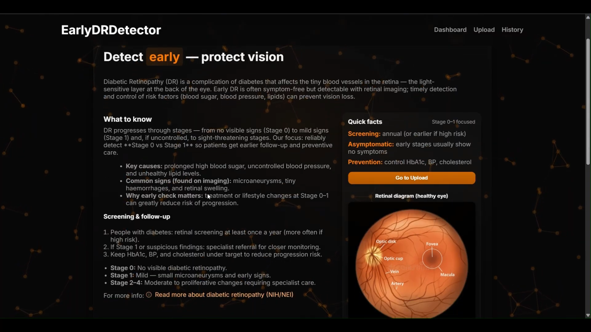
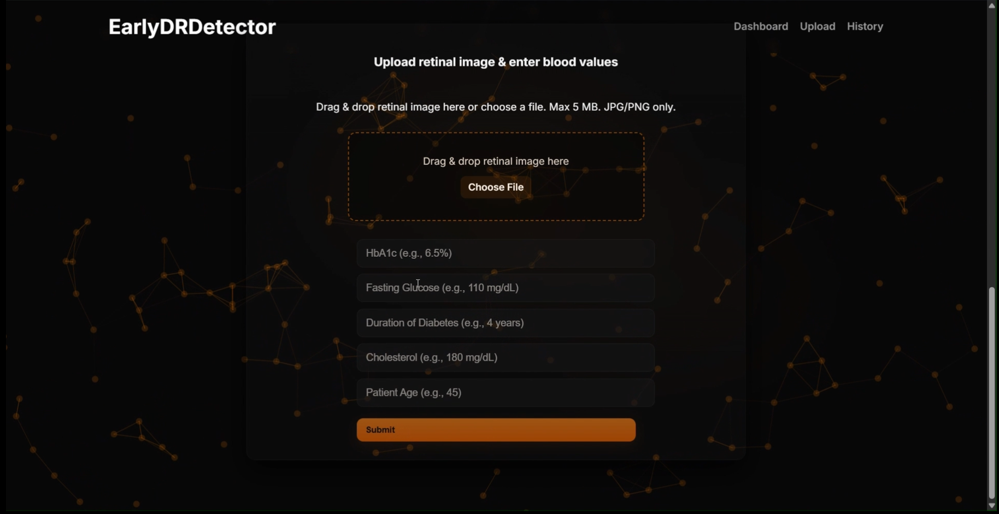
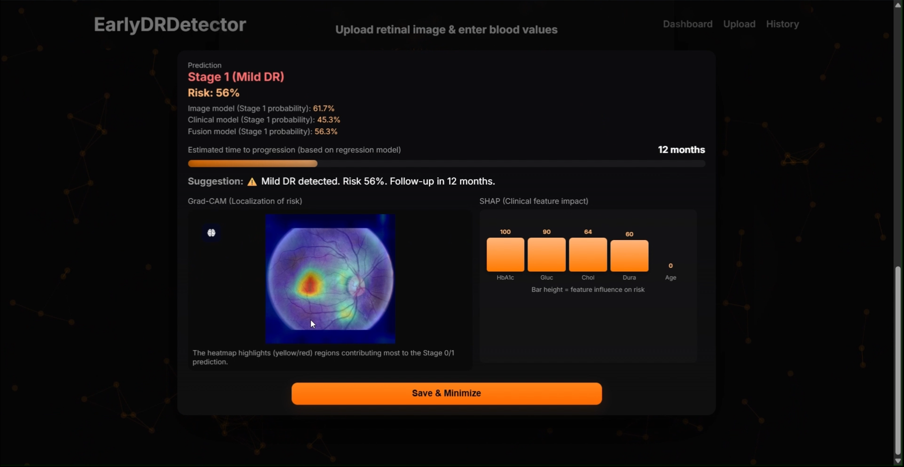
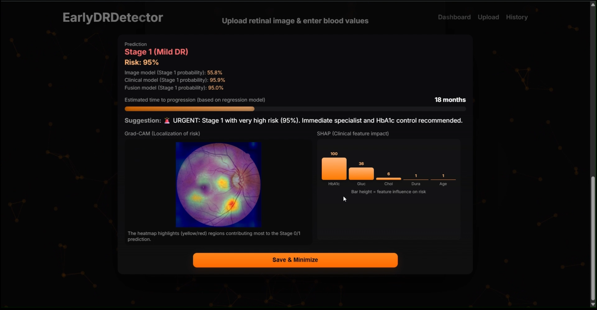
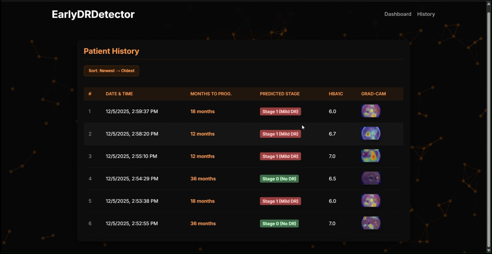

# EarlyDRDetector
### Explainable Multimodal AI for Early Diabetic Retinopathy Detection and Progression Prediction

Diabetic Retinopathy (DR) is one of the leading causes of preventable blindness and occurs when prolonged diabetes damages the blood vessels of the retina. Since the disease often develops without noticeable symptoms in its early stages, timely screening is essential to prevent irreversible vision loss.

EarlyDRDetector is a full-stack AI-powered screening platform that detects early-stage diabetic retinopathy (Stage 0 vs Stage 1) by combining retinal fundus images with clinical biomarkers. The system integrates a React frontend, Flask backend, PyTorch-based image model, LightGBM clinical model, and a late-fusion Logistic Regression model to provide accurate and interpretable predictions.

A key design principle of the project is the independent analysis of retinal images and clinical biomarkers. Both predictions are calibrated using Platt Scaling, uncertainty is estimated using entropy, and an uncertainty-aware fusion model generates the final diagnosis while Grad-CAM and SHAP provide visual explanations for every prediction.

---

# Screenshots

### Dashboard Overview


### Patient Upload Interface


### Prediction Results



### Prediction History


---

# System Architecture
*(Insert System Architecture Diagram Here)*

# Request Flow
1. User uploads a retinal fundus image and enters clinical biomarkers including HbA1c, fasting glucose, cholesterol, duration of diabetes, and age.
2. The React frontend sends the image and clinical data to the Flask backend.
3. The backend preprocesses the retinal image and standardizes the clinical features.
4. The EfficientNet-B4 image model and LightGBM clinical model independently generate disease probabilities.
5. Both probabilities are calibrated using Platt Scaling, and uncertainty is estimated using entropy.
6. A Logistic Regression late-fusion model combines the calibrated predictions to generate the final Stage 0 vs Stage 1 diagnosis.
7. The regression model estimates disease progression, while Grad-CAM and SHAP generate visual explanations.
8. The prediction results, explainability visualizations, and patient history are returned to the frontend for interactive display.

---

# Core Features

### Multimodal Disease Detection
- Early diabetic retinopathy screening using retinal fundus images
- Clinical biomarker-based disease assessment
- Stage 0 vs Stage 1 diabetic retinopathy classification
- Uncertainty-aware late fusion prediction

### Explainable AI
- Grad-CAM retinal heatmap visualization
- SHAP-based clinical feature importance
- Visual explanation of model predictions
- Transparent and interpretable AI decisions

### Intelligent Prediction Pipeline
- Independent image and clinical probability estimation
- Platt Scaling probability calibration
- Entropy-based uncertainty estimation
- Uncertainty-aware late fusion
- Disease progression prediction

### Interactive Dashboard
- Modern React-based web interface
- Retinal image upload
- Clinical data entry
- Real-time prediction visualization
- Patient-friendly disease information

### Prediction History
- Prediction history management
- Stored patient records
- Chronological prediction tracking
- Saved Grad-CAM visualizations
- Previous diagnosis review

---

# Model Performance

The proposed multimodal framework was evaluated on both an internal test set and an external validation dataset. The final fusion model combines calibrated image and clinical predictions using an uncertainty-aware late fusion strategy.

### Internal Test Performance

| Metric | Fusion Model |
|--------|-------------|
| Accuracy | 90.46% |
| ROC-AUC | 0.972 |
| Precision | 91.98% |
| Recall | 88.85% |
| F1-Score | 90.39% |

The fusion model achieved a balanced performance by combining retinal image features with clinical biomarkers, providing strong discrimination between Stage 0 and Stage 1 diabetic retinopathy while maintaining reliable probability calibration.

---

# Tech Stack

### Frontend
- React.js
- React Router
- CSS
- TSParticles

### Backend
- Flask
- Flask-CORS

### Deep Learning
- PyTorch
- TorchVision
- EfficientNet-B4 (timm)

### Machine Learning
- LightGBM
- Scikit-learn
- Logistic Regression

### Explainable AI
- Grad-CAM
- SHAP

### Computer Vision
- OpenCV
- Pillow

---

# Installation

### Clone Repository
```bash
git clone <your-repository-url>
cd EarlyDRDetector
```

### Backend
```bash
cd backend

python -m venv venv

# Windows
venv\Scripts\activate

pip install -r requirements.txt

python main.py
```

### Frontend
```bash
cd frontend
npm install
npm run dev
```

---

# Future Improvements
- Support multi-stage diabetic retinopathy classification (Stages 0–4)
- Validate the model on larger real-world clinical datasets
- Integrate Optical Coherence Tomography (OCT) imaging
- Deploy the system as a cloud-based screening platform
- Integrate Electronic Health Record (EHR) systems
- Extend the framework to detect additional retinal diseases

---

# Project Highlights

✅ Explainable Multimodal AI Architecture  
✅ EfficientNet-B4 Image Classification  
✅ LightGBM Clinical Risk Prediction  
✅ Uncertainty-Aware Late Fusion Learning  
✅ Platt Scaling Probability Calibration  
✅ Explainable AI using Grad-CAM and SHAP  
✅ Disease Progression Prediction  
✅ Interactive React + Flask Web Application  
✅ Prediction History Dashboard  
